[toc]

## 1. 项目介绍

本项目是论文[A new offset algorithm for closed 2D lines with Islands](./A new offset algorithm for closed 2D lines with islands.pdf)的JAVA实现。

该论文主要描述了多个非自交多边形轮廓内缩算法，何为轮廓内缩？就是将轮廓线向着多边形内部进行等距离缩进，在内缩过程中，需要解决新的轮廓点确定、自交点的去除等问题。用论文中的示意图演示如下：


## 2. 算法步骤

该算法主要包括三个步骤。

### 2.1 内缩点的生成

现有一个轮廓点序列P，为了生成内缩点，首先需要确定轮廓点的类型： 

轮廓点类型：

1. 凸点：以该轮廓点为顶点的内部角小于180°，如图a；

2. 凹点：以该轮廓点为顶点的内部角大于180°，如图b；

       3. 平点：以该轮廓点为顶点的内部角等于180°，如图c；

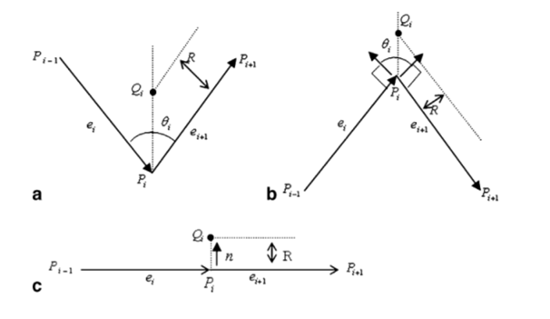

假设缩进距离为R，轮廓点$P_i$的缩进点表示为$Q_i$。$P_{i-1}$表示$P_i$的前一个轮廓点，$P_{i+1}$表示$P_i$的后一个轮廓点，则$θ_i$表示$P_{i-1}P_i$和$P_{i+1}P_i$之间的夹角。向量$e_i$和$e_{i+1}$分别表示从$P_{i-1}$指向$P_i$和$P_i$指向$P_{i+1}$的单位向量。

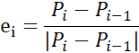

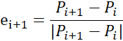

如果轮廓点Pi是凸点，如图a，则内缩点生成公式为：

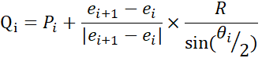

如果轮廓点Pi是凹点，如图b，则内缩点生成公式为：

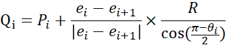

如果轮廓点Pi是平点，如图c，则内缩点生成公式为：

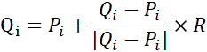


**由于无法找到方法确定每个点的类型，则采用如下方法确定内缩点：**

- 首先通过角平分线确定内缩点的方向，即单位向量$P_iP_{i-1}$和$P_iP_{i+1}$相加确定内缩点方向；
- 然后将每个点作为凸点计算内缩点距离，得到确定的内缩点；
- 通过射线法确定内缩点是否在轮廓内，如果在轮廓内，则表示该点是正确的内缩点；如果不在轮廓内，则表示相反的方向，相同的距离是正确的内缩点。


### 2.2 无效内缩线段的处理

如果轮廓线段过短，并且缩进距离过大，就有可能产生无效内缩线段，如图。

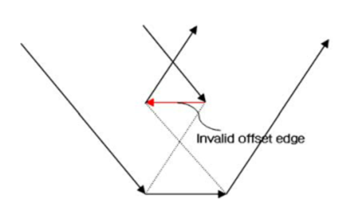

为了保证内缩轮廓的准确性，我们需要对无效内缩线段进行处理。首先，需要识别所有的无效内缩线段，然后进行处理。

首先我们需要识别无效内缩线段，利用无效内缩线段的方向与原轮廓线段方向相反的特点进行识别。即若轮廓点$P_i$，$P_j$的内缩点分别为$Q_i$，$Q_j$，则可以根据两向量点积的正负值判断：

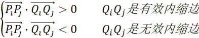

当识别了所有的无效内缩线段后，则根据无效内缩线段是否连续分为两种处理方式：

​        情形一：无效内缩线段不连续，即一条无效内缩线段的相邻线段都是有效内缩线段；

​        情形二：无效内缩线段连续，即存在至少两条无效内缩线段相邻；

在提出无效内缩线段的解决方法之前，我们提出两个概念：前置边和后置边。按照轮廓方向遍历，前置边是指无效内缩线段按照轮廓方向向前的第一条有效内缩线段，同理，后置边是指无效内缩线段按照轮廓方向向后的第一条有效内缩线段。

现在我们考虑情形一的处理方法，即无效内缩线段不连续。处理步骤如下：

​    （1）计算无效内缩线段的前置边和后置边的交点P；

​    （2）更新无效内缩线段的前置边的起点为交点P，更新后置边的终点为P；

算法图示如下：

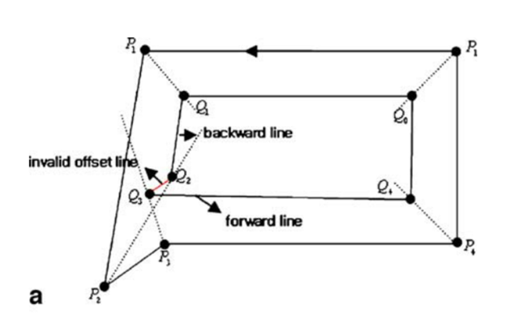

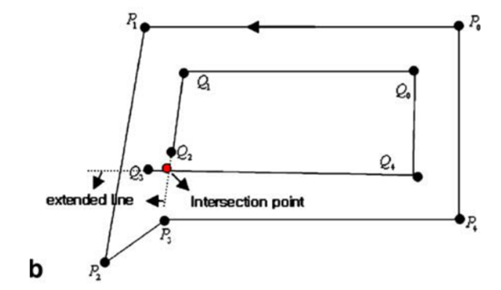

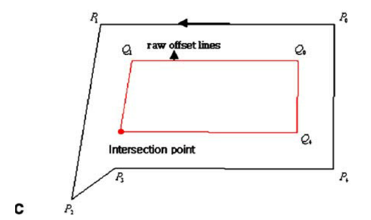

现在我们考虑情形二的处理方法，即无效内缩线段连续。处理步骤如下：

​    （1）找到无效内缩线段所对应的原轮廓边，并采用传统的线段内缩方法得到新的对应的内缩线段；

​    （2）分别计算新的内缩线段与原轮廓的交点，并更新新的内缩线段；

​    （3）分别计算新的内缩线段与前置边和后置边的交点，并更新前置边的起点为交点，后置边的终点为交点；

​    （4）计算前置边和后置边的交点，并更新前置边的起点为交点，后置边的终点为交点。

算法图示如下：

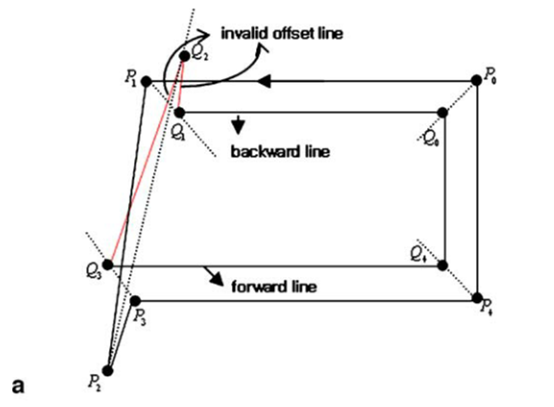

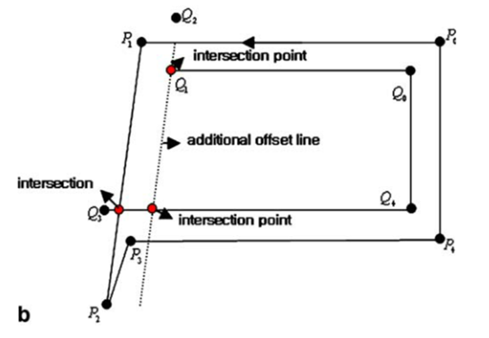

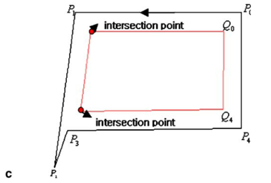


### 2.3 全局无效环的处理

在处理了无效内缩线段后，全局无效环有可能出现，如图所示：

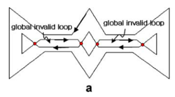

为了保证结果的准确性，我们需要消除全局无效环。在进行详细算法描述之前，我们需要确定追踪规则。

​    追踪规则：从起始点沿着轮廓方向进行追踪，如果遇到自交点，则将自交点存入栈中，作为下一个起始点，并改变追踪方向为相交线段的方向。

​    算法主要包括四步：

​    （1）在内缩轮廓中任意选取一个起始点，并标记为已访问；

​    （2）遵循追踪规则进行内缩轮廓点的访问，如果该点未被访问，则进行已访问标记；如果访问的该点与起始点相同，则表示已访问了一个环，进行下一步判断。如果该点已访问，则表示原轮廓过于复杂，生成的内缩轮廓存在异常情况，此时应结束整个算法流程。

​    （3）如果该环的方向与原轮廓的方向相同，则表示该环不是全局无效环，接纳为有效内缩轮廓；反之则舍弃。

​	（4）如果栈不为空，则将栈顶元素弹出作为起始点，然后进行步骤（1）——（3），直至栈为空。

最终，所有返回的环就是内缩轮廓结果，如图所示：

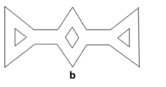


## 3. 使用方法及结果演示

### 3.1 使用方法

首先，从release中下载jar包，然后导入到自己的工程项目中。

然后创建多边形的点列表，调用算法，画图显示结果。

**注意，**如果每层之间的距离是负数，则会生成外扩轮廓。

```java
// import com.lee.algorithm.OffsetAlgorithm;
// import com.lee.display.MainWindow;
// import com.lee.entity.Point;

// 准备多边形数据
List<Point> polygon = Arrays.asList(
    new Point(100,100),
    new Point(200,100),
    new Point(300,200),
    new Point(200,300),
    new Point(100,300)
);
// 结果数据
List<List<Point>> contours = new ArrayList<>();
contours.add(polygon);
// 生成5层内缩轮廓，每层之间的距离为10
for (int i = 1; i <= 5; i++){
    List<List<Point>> offset = OffsetAlgorithm.offsetAlgorithm(polygon, 10*i);
    if (offset != null) {
        contours.addAll(offset);
    }
}
// 画图显示
MainWindow mainWindow = new MainWindow(contours);
mainWindow.show();
```

结果：


### 3.2 结果演示

本节主要演示各种不同的图形生成内缩轮廓效果。主要的代码文件在`test/com/lee/test/OffsetTest.java`中，多边形轮廓点数据在`file`文件夹下。

```java
// 生成三角形的内缩轮廓，共十层内缩轮廓，每层之间的距离为3.0 
offsetTest("file/triangle.txt",3.0,10);
```

结果演示：最外层是原始的多边形轮廓


```java
offsetTest("file/rectangle.txt",3.0,20);
```


```java
offsetTest("file/star.txt",3.0,10);
```


```java
offsetTest("file/tunnel.txt",3.0,25);
```


```java
offsetTest("file/5edge.txt",5.0,5);
```


## 4. 不足之处

- 对于本算法，如果内缩的距离过大或多边形过小，则会导致结果的不准确。

  例如：内部已经出现轮廓相交缠绕的情况。

  解决方法：可以以内缩轮廓为原始轮廓，再次小距离缩进。不要以最初的轮廓进行大距离缩进。

  

- 对于自交的图形，本算法无法解决；对于曲线图形，本算法无法解决。针对这两个问题，GitHub有相关项目已经解决，具体可参考：https://github.com/jbuckmccready/CavalierContours，相关论文可参考：[An offset algorithm for polyline curves](An offset algorithm for polyline curves.pdf)。
- 对于工程结构、算法细节来说，本项目还有待提升。


## 5. 参考资料

[1] Kim, H.-C., Lee, S.-G., & Yang, M.-Y. (2005). A new offset algorithm for closed 2D lines with Islands. The International Journal of Advanced Manufacturing Technology, 29(11-12), 1169–1177. doi:10.1007/s00170-005-0013-1

[2] Liu, X.-Z., Yong, J.-H., Zheng, G.-Q., & Sun, J.-G. (2007). An offset algorithm for polyline curves. Computers in Industry, 58(3), 240–254. doi:10.1016/j.compind.2006.06.002