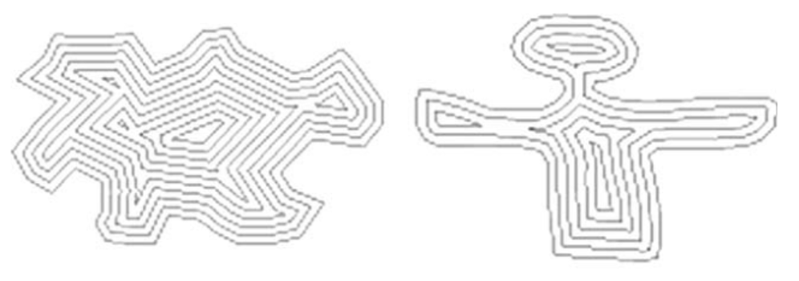
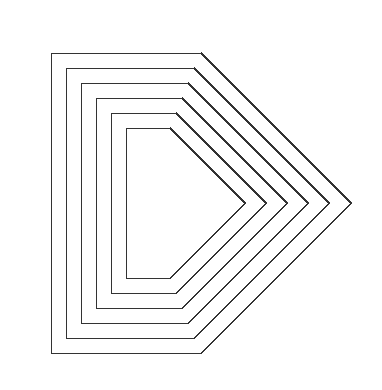
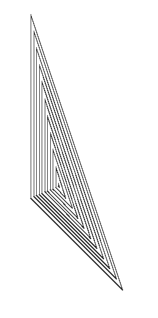
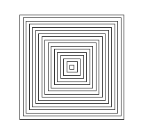
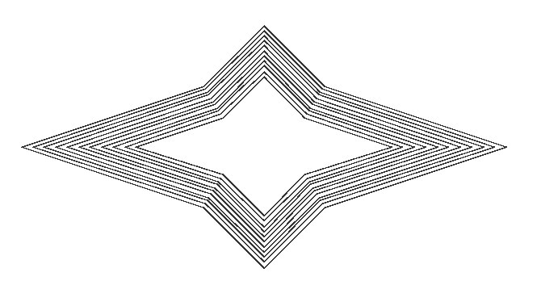
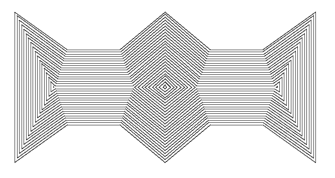
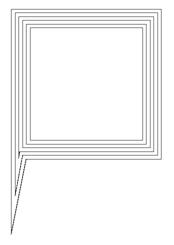
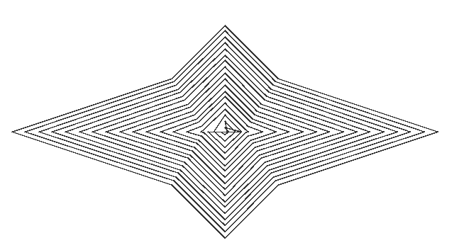

[toc]

## 1. 项目介绍

本项目是论文[A new offset algorithm for closed 2D lines with Islands](./A new offset algorithm for closed 2D lines with islands.pdf)的JAVA实现。

该论文主要描述了多个非自交多边形轮廓内缩算法，何为轮廓内缩？就是将轮廓线向着多边形内部进行等距离缩进，在内缩过程中，需要解决新的轮廓点确定、自交点的去除等问题。用论文中的示意图演示如下：




## 2. 算法步骤


## 3. 使用方法及结果演示

### 3.1 使用方法

首先，从release中下载jar包，然后导入到自己的工程项目中。

然后创建多边形的点列表，调用算法，画图显示结果。

**注意，**如果每层之间的距离是负数，则会生成外扩轮廓。

```java
// import com.lee.algorithm.OffsetAlgorithm;
// import com.lee.display.MainWindow;
// import com.lee.entity.Point;

// 准备多边形数据
List<Point> polygon = Arrays.asList(
    new Point(100,100),
    new Point(200,100),
    new Point(300,200),
    new Point(200,300),
    new Point(100,300)
);
// 结果数据
List<List<Point>> contours = new ArrayList<>();
contours.add(polygon);
// 生成5层内缩轮廓，每层之间的距离为10
for (int i = 1; i <= 5; i++){
    List<List<Point>> offset = OffsetAlgorithm.offsetAlgorithm(polygon, 10*i);
    if (offset != null) {
        contours.addAll(offset);
    }
}
// 画图显示
MainWindow mainWindow = new MainWindow(contours);
mainWindow.show();
```

结果：



### 3.2 结果演示

本节主要演示各种不同的图形生成内缩轮廓效果。主要的代码文件在`test/com/lee/test/OffsetTest.java`中，多边形轮廓点数据在`file`文件夹下。

```java
// 生成三角形的内缩轮廓，共十层内缩轮廓，每层之间的距离为3.0 
offsetTest("file/triangle.txt",3.0,10);
```

结果演示：最外层是原始的多边形轮廓



```java
offsetTest("file/rectangle.txt",3.0,20);
```




```java
offsetTest("file/star.txt",3.0,10);
```



```java
offsetTest("file/tunnel.txt",3.0,25);
```



```java
offsetTest("file/5edge.txt",5.0,5);
```




## 4. 不足之处

- 对于本算法，如果内缩的距离过大或多边形过小，则会导致结果的不准确。

  例如：内部已经出现轮廓相交缠绕的情况。

  解决方法：可以以内缩轮廓为原始轮廓，再次小距离缩进。不要以最初的轮廓进行大距离缩进。

  

- 对于自交的图形，本算法无法解决；对于曲线图形，本算法无法解决。针对这两个问题，GitHub有相关项目已经解决，具体可参考：https://github.com/jbuckmccready/CavalierContours，相关论文可参考：[An offset algorithm for polyline curves](An offset algorithm for polyline curves.pdf)。
- 对于工程结构、算法细节来说，本项目还有待提升。


## 5. 参考资料

[1] Kim, H.-C., Lee, S.-G., & Yang, M.-Y. (2005). A new offset algorithm for closed 2D lines with Islands. The International Journal of Advanced Manufacturing Technology, 29(11-12), 1169–1177. doi:10.1007/s00170-005-0013-1

[2] Liu, X.-Z., Yong, J.-H., Zheng, G.-Q., & Sun, J.-G. (2007). An offset algorithm for polyline curves. Computers in Industry, 58(3), 240–254. doi:10.1016/j.compind.2006.06.002